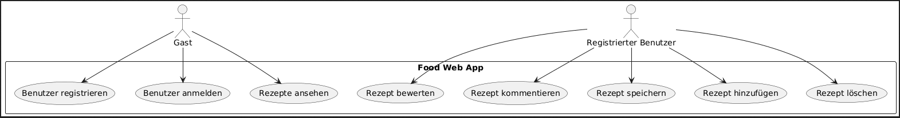

= Use case Diagramm
Lorenz Parzer, Leon Marazovic, Marko Trkulja, Mario Solomun
1.0.0, {docdate}

== Beschreibung

=== Gast
Nicht authentifizierter Nutzer (nicht angemeldet). Er kann sich Rezepte anschauen sich anmelden und registrieren.

=== Registrierter Benutzer
Ein angemeldeter Benutzer mit einem persönlichen Konto. Er kann Rezepte erstellen